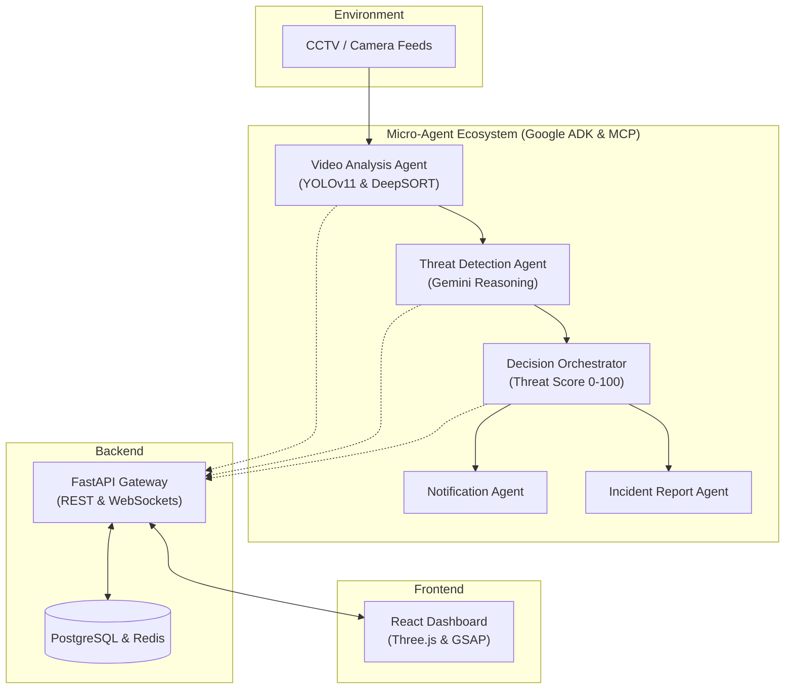

<div align="center">

# GuardianAI: Multi-Agent Intelligent Surveillance

**Proactive, autonomous threat detection and emergency coordination using a robust ecosystem of specialized AI agents.**

This project demonstrates a production-quality, multi-agent AI system designed to autonomously monitor CCTV feeds, detect anomalies, reason about threats, and coordinate emergency responses using the Google Agent Development Kit (ADK) and Model Context Protocol (MCP).

[](https://python.org)
[](https://fastapi.tiangolo.com/)
[](https://reactjs.org/)
[](https://www.postgresql.org/)
[](https://www.docker.com/)

</div>

---

## Overview

Traditional CCTV systems rely purely on continuous human monitoring. Security personnel must track multiple screens, leading to cognitive fatigue where critical incidents (unauthorized access, loitering, violence, fire) go unnoticed until it's too late.

**GuardianAI** solves this by employing an autonomous ecosystem of specialized AI agents. Instead of monolithic processing, GuardianAI employs a **Micro-Agent Architecture** where each agent executes specific responsibilities and communicates over the Model Context Protocol (MCP) using a shared context and environment.

---

## Features

| Feature | Description |
|----------|-------------|
| **Micro-Agent Architecture** | Specialized agents handle video analysis, threat detection, decisions, and notifications independently. |
| **Model Context Protocol (MCP)** | Agents utilize tools (`camera_tool`, `screenshot_tool`) autonomously to verify events. |
| **Explainable AI (XAI)** | The Decision Agent outputs a "Chain of Thought" reasoning block before escalating threat levels. |
| **Real-Time Processing** | Asynchronous API Gateway via FastAPI handling REST and WebSockets. |
| **Glassmorphism UI** | A beautiful, dynamic frontend built with Framer Motion, Three.js, and TailwindCSS. |

---

## Architecture



---

## Tech Stack

- **AI/ML:** YOLOv11, OpenCV, Gemini Pro, Google ADK
- **Backend:** Python 3.11+, FastAPI, SQLAlchemy, Alembic
- **Database:** PostgreSQL (Incidents, Users), Redis (Rate limiting, temporal state)
- **Frontend:** React, TypeScript, TailwindCSS, Framer Motion, Three.js, Lucide Icons
- **DevOps:** Docker, Docker Compose, Nginx
- **Security:** JWT Authentication, RBAC

---

## Quick Start

### Prerequisites

- Docker & Docker Compose
- Node.js 20+ (for local frontend development)
- Python 3.11+ (for local backend development)

### Installation (Docker Recommended)

Clone the repository:

```bash
git clone https://github.com/yourusername/GuardianAI.git
cd GuardianAI
```

Start the application using Docker Compose:

```bash
docker-compose up --build -d
```

The application will be available at:
- **Dashboard:** `http://localhost:5173`
- **API Docs:** `http://localhost:8000/docs`

---

## Project Structure

```
GuardianAI/
│
├── agents/             # Google ADK Agent definitions and logic
├── backend/            # FastAPI server, routers, and schemas
├── frontend/           # React + Vite dashboard and UI components
├── mcp/                # Model Context Protocol tool definitions
├── models/             # YOLOv11 and other ML model weights
├── database/           # SQLAlchemy models and Alembic migrations
├── docker/             # Dockerfiles for various services
├── configs/            # Configuration files and environment setups
├── tests/              # Unit and integration tests
├── tools/              # Helper scripts and utilities
├── screenshots/        # Assets for documentation
└── docker-compose.yml  # Main deployment configuration
```

---

## Kaggle Submission (Agents for Good)

**Motivation:** Public and private spaces generate terabytes of video data daily, yet 99% is never analyzed until a post-incident forensic review. We built GuardianAI to shift surveillance from a passive recording tool to a proactive, intelligent guardian.

**Explainability:** The system is prompted to output a "Chain of Thought" reasoning block before escalating a threat level. This ensures security operators understand *why* an alert was generated, building trust in autonomous surveillance.

---

## Future Improvements

- Audio analysis integration (e.g., breaking glass, screaming).
- Integration with physical IoT devices (e.g., locking doors autonomously).
- Multi-modal embeddings vector search for advanced forensic queries (e.g., "Find the person wearing a red backpack from last week").

---

## License

This project is licensed under the MIT License - see the LICENSE file for details.

---

<div align="center">
<sub>Built with Google ADK, Model Context Protocol, Gemini, FastAPI, and React.</sub>
</div>