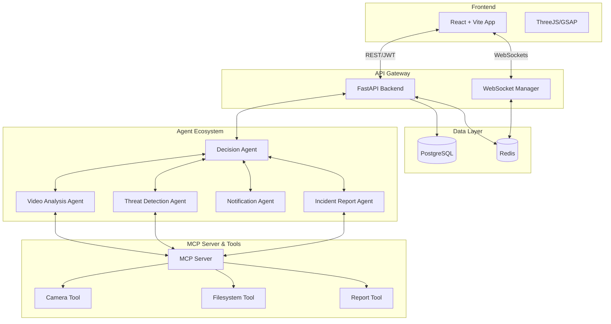
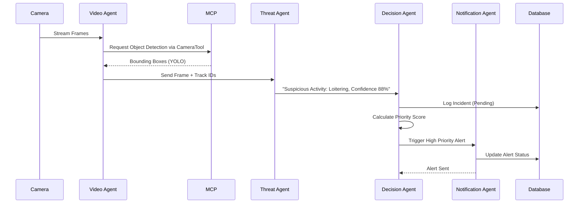
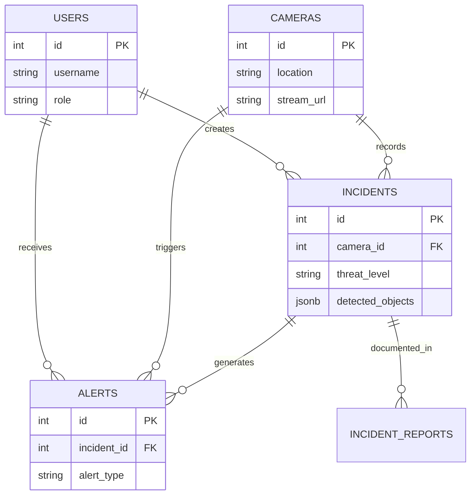

# GuardianAI Architecture

## 1. System Architecture Diagram

```mermaid
graph TD
    subgraph Frontend
        React[React + Vite App]
        ThreeJS[ThreeJS/GSAP]
    end

    subgraph API Gateway
        FastAPI[FastAPI Backend]
        WS[WebSocket Manager]
    end

    subgraph Data Layer
        PG[(PostgreSQL)]
        Redis[(Redis)]
    end

    subgraph Agent Ecosystem
        DA[Decision Agent]
        VA[Video Analysis Agent]
        TDA[Threat Detection Agent]
        NA[Notification Agent]
        IRA[Incident Report Agent]
    end

    subgraph MCP Server & Tools
        MCP[MCP Server]
        CamT[Camera Tool]
        FsT[Filesystem Tool]
        RepT[Report Tool]
    end

    React <-->|REST/JWT| FastAPI
    React <-->|WebSockets| WS
    FastAPI --> PG
    FastAPI <--> Redis
    WS <--> Redis
    
    FastAPI <--> DA
    DA <--> VA
    DA <--> TDA
    DA <--> NA
    DA <--> IRA
    
    VA <--> MCP
    TDA <--> MCP
    IRA <--> MCP
    
    MCP --> CamT
    MCP --> FsT
    MCP --> RepT
```

## 2. Agent Flow Diagram

```mermaid
sequenceDiagram
    participant Camera
    participant VA as Video Agent
    participant MCP
    participant TDA as Threat Agent
    participant DA as Decision Agent
    participant NA as Notification Agent
    participant DB as Database
    
    Camera->>VA: Stream Frames
    VA->>MCP: Request Object Detection via CameraTool
    MCP-->>VA: Bounding Boxes (YOLO)
    VA->>TDA: Send Frame + Track IDs
    TDA->>DA: "Suspicious Activity: Loitering, Confidence 88%"
    DA->>DB: Log Incident (Pending)
    DA->>DA: Calculate Priority Score
    DA->>NA: Trigger High Priority Alert
    NA->>DB: Update Alert Status
    NA-->>DA: Alert Sent
```

## 3. Database ER Diagram

```mermaid
erDiagram
    USERS ||--o{ INCIDENTS : creates
    USERS ||--o{ ALERTS : receives
    CAMERAS ||--o{ INCIDENTS : records
    CAMERAS ||--o{ ALERTS : triggers
    INCIDENTS ||--o{ ALERTS : generates
    INCIDENTS ||--o{ INCIDENT_REPORTS : documented_in
    
    USERS {
        int id PK
        string username
        string role
    }
    CAMERAS {
        int id PK
        string location
        string stream_url
    }
    INCIDENTS {
        int id PK
        int camera_id FK
        string threat_level
        jsonb detected_objects
    }
    ALERTS {
        int id PK
        int incident_id FK
        string alert_type
    }
```
